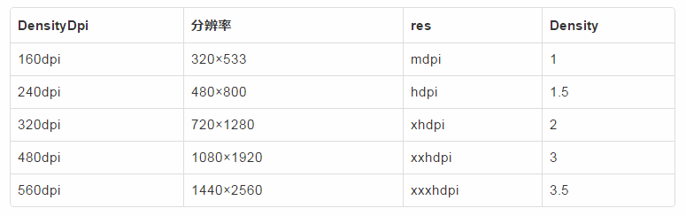
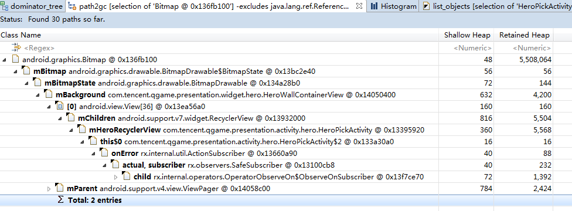
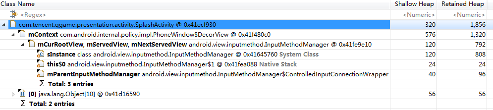
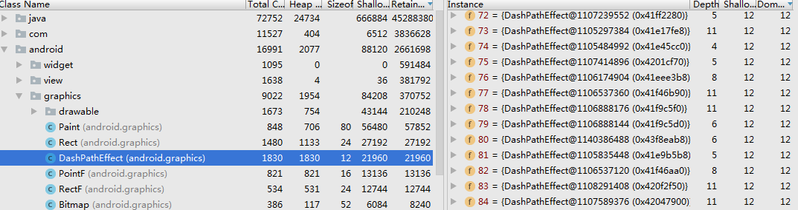
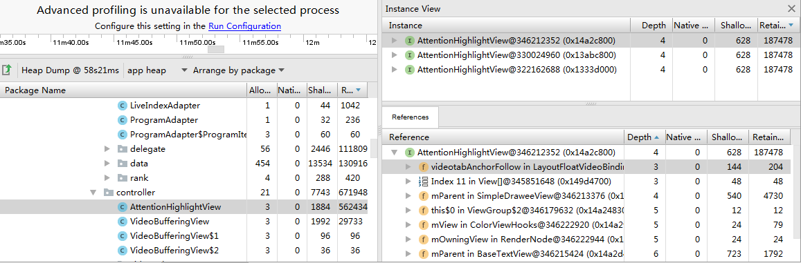
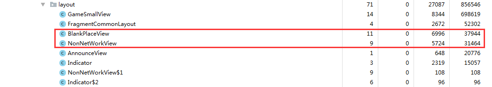
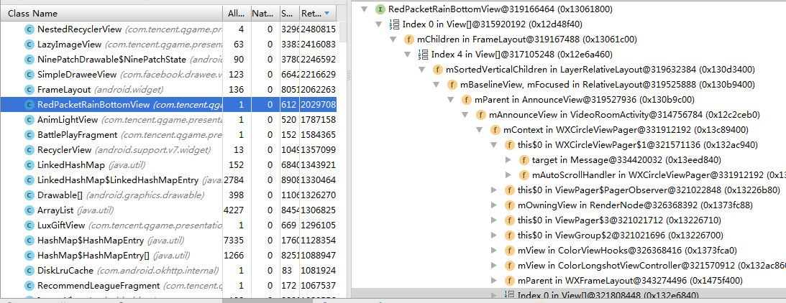
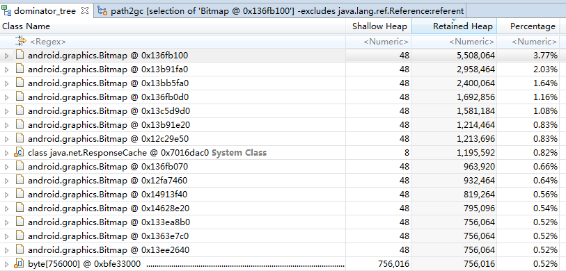

# 内存分析

[TOC]

## 1.进程可使用的内存

两个方法获取应用得可用内存大小：

- ActivityManager.getMemoryClass()
- ActivityManager.getLargeMemoryClass()

/system/build.prop文件，或者

```
dalvik.vm.heapstartsize=8m
dalvik.vm.heapgrowthlimit=128m
dalvik.vm.heapsize=512m
```

**dalvik.vm.heapstartsize=8m**

相当于虚拟机的 -Xms配置，设置堆内存的初始大小。

**dalvik.vm.heapgrowthlimit=128m**

相当于虚拟机的 -XX:HeapGrowthLimit配置，一个应用的最大堆内存大小

**dalvik.vm.heapsize=512m**

当于虚拟机的 -Xmx配置，设置了使用android:largeHeap的应用的最大堆内存大小。

可以在manifest文件application节点加入android:largeHeap=“true”即可使应用的最大内存增大。

##2.应用什么时候被杀死

移动终端内存有限，当前可用内存不够时，会根据按应用进程类型的优先级和内存占用大小结束进程

- 超过虚拟机内存上限会抛出OOM，程序崩溃，上限根据largeHeap参数可能是heapsize或heapgrowthlimit

- 通过Low memory killer机制杀死进程。Low memory killer指定了一组内存临界值。若某个进程的进程描述符中的oom_adj在同一范围，该进程将被杀死。

- /sys/module/lowmemorykiller/parameters/adj和/sys/module/lowmemorykiller/parameters/minfree

  两个文件中的值一一对应，以逗号分割

  | **级别类型** | **oom_adj** | 内存警戒值( 以4K为单位） |
  | -------- | ----------- | -------------- |
  | 前台进程     | 0           | 1536           |
  | 可见进程     | 1           | 2048           |
  | 后台服务     | 2           | 4096           |
  | 桌面程序     | 4           |                |
  | 后台进程     | 7           | 5120           |
  | 内容供应点    | 14          | 5632           |
  | 缓存进程     | 15          | 6144           |

当前可用内存小于5120*4K=20M时，所有oom_adj值大于7的进程都会被kill，相同的oom_adj下，内存大的，优先被杀。

- 查看下一个可能被杀的进程 dumpsys meminfo --oom

## 3.OOM

Android系统对dalvik的vm heapsize作了硬性限制，当java进程申请的java空间超过阈值时，就会抛出OOM异常。程序发生OMM并不表示RAM不足，而是因为程序申请的java heap对象超过了dalvik vm heapgrowthlimit。也就是说，在RAM充足的情况下，也可能发生OOM。

App为什么会OOM呢？其实就是申请的内存太大，而剩余的内存不足以分配这么大

- 数据结构设计不合理，冗余
- 数据本身就太大
- 频繁的分配导致内存碎片
- 内存泄露，导致内存无法使用
  Native层当无指针指向一段内存空，Java层当生命期较长的引用一直指向对象

##4.内存杀手：图片

图片加载到内存占多大内存？

参考[安卓开踩过的坑：你的 Bitmap 究竟占多大内存？](http://dev.qq.com/topic/591d61f56793d26660901b4e)

一张图片加载到内存后的大小为 width * height * scale * 每个像素字节数

scale = targetDensity/density

BitmapFactory.Options对象的inScaled、inDensity、inTargetDensity、screenDensity四个值共同决定了bitmap是否被缩放以及缩放的倍数。

```java
const int density = env->GetIntField(options, gOptions_densityFieldID);
const int targetDensity = env->GetIntField(options, gOptions_targetDensityFieldID);
const int screenDensity = env->GetIntField(options, gOptions_screenDensityFieldID);
//重点就是这里了，density、targetDensity、screenDensity的值决定了是否缩放、以及缩放的倍数
if (density != 0 && targetDensity != 0 && density != screenDensity) {
     scale = (float) targetDensity / density;
}
```

Density、分辨率、-hdpi等res目录之间的关系



对于一张1280720的图片，如果放在xhdpi，那么xhdpi的设备拿到的大小还是1280720,而xxhpi的设备拿到的可能是1920*1080，这两种情况在内存里的大小分别为:3.68M和8.29M相差4.61M。

图片绝对占据了应用得大部分内存，因此，对图片资源的使用要小心

尽量避免直接手动拿到一个bitmap或者drawable？可以参考[GlideBitmapPool](https://github.com/amitshekhariitbhu/GlideBitmapPool)


## 5.查看应用所占的内存

###5.1procrank

###5.2dumpsys meminfo

### 5.3MAT

#### 使用介绍：

[MAT使用教程](http://blog.csdn.net/itomge/article/details/48719527)

[MAT - Memory Analyzer Tool 使用进阶](http://www.lightskystreet.com/2015/09/01/mat_usage/)

histogram视图：类视图，这个页面可以搜索一些常见的类的泄露，比如最常见的Activity，对Activity数量不止一个的对象都有可能是泄露的对象，需要进行排查

Dominator视图：支配树

- Shallo Heap: 对象本身占用内存的大小，不包含其引用的对象内存。
- Retained Heap： Retained heap值的计算方式是将retained set中的所有对象大小叠加。或者说，由于X被释放，导致其它所有被释放对象（包括被递归释放的）所占的heap大小。

#### 如何理解MAT的引用链

以下面这个Bitmap泄露为例



在引用链中黑色的小箭头表示引用着，下面一行引用着上面一行的变量，左边的成员变量表示具体是那个变量引用着该对象。

> Bitmap的“内存地址”0x136fb100，被`BitmapDrawable的内部类BitmapState`的成员变量mBitmap引用着
>
> `BitmapDrawable的内部类BitmapState`又被`BitmapDrawable`的mBitmapState变量引用着
>
> `BitmapDrawable`又被`HeroWallContainerView`的mBackground变量引用着
>
> `HeroWallContainerView`又被RecyclerView的引用...
>
> ..
>
> HeroPickActivity被HeroPickActivity的第二个匿名内部类引用着
>
> 最终定位到是因为RxJava造成的内存泄露，发现代码确实未使用CompositeSubscription。

符号解释：

- this\$0 表示某个类的外部第一个类， 同理还有this\$1、this\$2等。
- classA\$classB表示classA的内部类classB
- class\$2 表示类class的第2个匿名内部类

#### 配合GIMP查看Bitmap

使用mat还可以配合GIMP软件查看bitmap。


比如我们用MAT查看某时刻的hprof发现一个bitmap占用了1.8M内存。通过定位该bitmap的引用链，可以查看到这个bitmap无法释放的原因。但这仍不有助于我们分析问题到底出在哪里，这时可以通过以下方式定位到这个图片到底是哪个。这里是由于被Fresco的内存缓存引用着，由于以后再也用不到这张图了，可以从内存中移除。


在左侧的Attributes窗口中包含了关于这个bitmap的相关信息

- mBuffer该bitmap的像素信息
- mHeight和mWidth分别表示bitmap的宽度和高度，这两个参数在后面将会用到

右键mBuffer -> Copy -> Save Value To File，将像素信息保存为xxx.data文件，接下来在GIMP软件中点击文件 -> 打开，选择刚才生成的xxx.data文件，设置好正确的参数就可以查看到对应的bitmap了，这样更容易定位内存问题。


### 5.4 AndroidStudio3.0

新版的AndroidStudio3.0推出了Android Profilers工具。启动方法：点击 View->Tool Windows->Android Profiler（也可以直接在工具栏中点击 Android Profiler ）

选择设备/进程后就会显示CPU/MEMORY/NETWORK的实时情况，点击内存区块就会显示当前进程的实时内存情况。


垃圾桶图标：手动强制触发Full GC，如果直接dump也会触发

- 下载按钮：dump Java Heap。Dump当前应用的内存分配情况，dump下来的hprof内存文件为非标准的内存文件，如果需要使用MAT工具打开，需要用hprof_conv工具转换
- 红色圆形按钮：实时记录内存分配情况，该功能可以记录某一时间段内内存的分配情况。
- dump堆内存

各种内存介绍：


点击dump下来文件，可以看到一共有三个窗口：

- 左上角区域为当前内存中的全部对象
- 选中某对象，右上角区域显示为该对象的全部实例
- 选中某一个对象，下方可以显示该对象的引用树


从上图中发现DashPathEffect对象竟然有5790个，占用内存多达92K，通过对象的引用树可以找到是哪些地方引用了这些对象导致其未被释放，经过定位发现这些对象最终都被AnimatedPathView引用着，并且每个AnimatedPathView都会创建100个DashPathEffect对象，这显然是不合理的。


利用AndroidStudio分析内存的思路：

- dump某个时刻应用得内存情况。根据Retained Size内存大小进行排序
- 优先分析那些内存大的，数量不止一个的对象，通过对象引用链，分析当前对象未被释放的原因
- 思考是否合理，并考虑是否出现了内存泄露、数据结构设计是否合理


###5.5LeakCanary

LeakCanary是[Square](http://square.github.io/) 公司开源的一个第三方内存泄漏检测库。可以通过简单的方式来让开发者方便的查看到应用的内存泄露情况。

####使用：

1. `RefWatcher.watch()` 创建一个 [KeyedWeakReference](https://github.com/square/leakcanary/blob/master/library/leakcanary-watcher/src/main/java/com/squareup/leakcanary/KeyedWeakReference.java) 到要被监控的对象。
2. 然后在后台线程检查引用是否被清除，如果没有，调用GC。
3. 如果引用还是未被清除，把 heap 内存 dump 到 APP 对应的文件系统中的一个 `.hprof` 文件中。
4. 在另外一个进程中的 `HeapAnalyzerService` 有一个 `HeapAnalyzer` 使用[HAHA](https://github.com/square/haha) 解析这个文件。
5. 得益于唯一的 reference key, `HeapAnalyzer` 找到 `KeyedWeakReference`，定位内存泄露。
6. `HeapAnalyzer` 计算 *到 GC roots 的最短强引用路径*，并确定是否是泄露。如果是的话，建立导致泄露的引用链。
7. 引用链传递到 APP 进程中的 `DisplayLeakService`， 并以通知的形式展示出来。

`LeakCanary.install()` 会返回一个预定义的 `RefWatcher`，同时也会启用一个 `ActivityRefWatcher`，用于自动监控调用 `Activity.onDestroy()` 之后泄露的 activity。

```java
public class ExampleApplication extends Application {

  public static RefWatcher getRefWatcher(Context context) {
    ExampleApplication application = (ExampleApplication) context.getApplicationContext();
    return application.refWatcher;
  }

  private RefWatcher refWatcher;

  @Override public void onCreate() {
    super.onCreate();
    refWatcher = LeakCanary.install(this);
  }
}

```

使用 `RefWatcher` 监控 Fragment：

```java
public abstract class BaseFragment extends Fragment {

  @Override public void onDestroy() {
    super.onDestroy();
    RefWatcher refWatcher = ExampleApplication.getRefWatcher(getActivity());
    refWatcher.watch(this);
  }
}
```

####如何分析：

当应用发生内存泄漏时，会自动dump内存，分析后以通知的形式展示出来。通过展示出来的引用链就可以清楚地看到内存泄漏的原因。

下面展示了我们APP中的直播间的内存泄漏，具体是Activity泄露

- HandlerThread引用着Message（被局部变量持有？死循环导致未被释放？）

- Message对象引用着VideoRoomPullDownPanelView的第二个匿名内部类（作为Message的obj变量的值）

- 这个匿名内部类又引用着外部的VideoRoomPullDownPanelView（匿名内部类内部引用了外部类this$0）

- 它又引用着VideoRoomActivity，最终导致了该Activity的泄露（VideoRoomPullDownPanelView内部的mContext）

  ​

  


除了LeakCanary，还有一些其他的工具LeakInspector/WxPerformanceTool/LeakParser都可以用于检测内存泄漏

###5.6 根据上报信息分析内存 

目前项目中接入了MagnifierSDK可以进行内存检测，Fresco图片泄露也可以在mta上查到。通过上报的信息可以分析现网的内存情况。

## 6.场景分析（案例分析）

### 6.1APP处于后台

1.活动图片按照运营的配置显示一次，但是消失后仍然占用了近2M的内存，而这个图片以后再也不会显示了，因此应该在消失后从内存中移除

优化目标：彻底干掉，预计节省2M内存

2.SplashActivity疑似泄露，由于系统输入法泄露？



###6.2启动后首页tab来回切换

1.每张banner图占用了大约600K

2.AnimatedPathView持有的对象太多,持有的pathEffect，这个map包含了60个对象DashPathEffect，只要View在，每个View都要持有这么多，应该在每次进行动画的时候在创建，resetPath的时候清除掉这些对象



3.LiveGameDataLoader应该使用单例，否则一初始化就有5个，每个实例里面还可能缓存英雄数据，浪费内存。

4.首页的视频tab中的关注button占用570K，如果用户没有进入视频tab，或者观看过程中并不需要弹出关注按钮，这个按钮是有很大几率不需要显示的，应该延迟加载。

优化目标：延迟加载，减少内存570K



5.现网大部分情况都有数据，无数据和无网络界面占用60K



6.RedPacketRainBottomView占用2M，同时发现主要因为VideoRoomActivity被weex页面引用着导致泄露




###6.3 除了直播间以外的其他页面来回切换

回到首页，dump内存，发现了很多大图



1.通过MAT配合GIMP发现占用5M、3M内存的大图是英雄墙的背景图（同时也未压缩），页面已经退出了，同时在Histogram视图搜索HeroPickeActivity发现该Activity泄露。


优化目标：彻底杜绝Activity泄露

2.


##6优化收益


